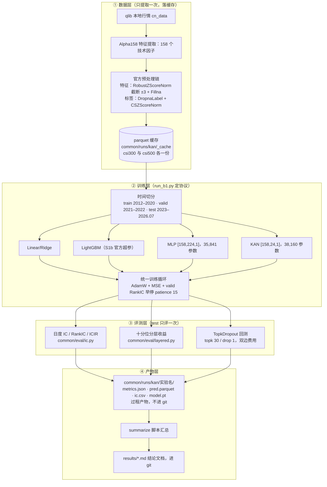
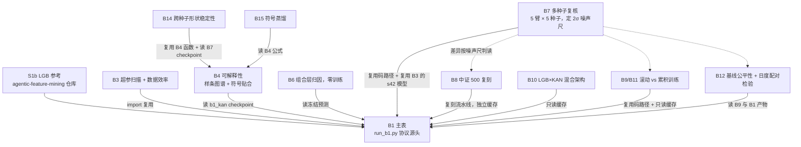

# kan-spline-bench 设计文档

一句话：在 Qlib + Alpha158 的标准化股票预测评测下，检验「用 KAN 做因子非线性合成」相比线性模型、LightGBM、MLP 到底强不强、强在哪，并把每一个结论都配上统计可信度检验。全部 B 系列实验已收尾（2026-09-15），本文档描述这套实验机器是怎么搭的。

## 1. 先解释几个名词

- **Qlib**：微软开源的量化研究框架，本项目的数据管道和回测都建在它上面。
- **Alpha158**：Qlib 自带的 158 个技术因子库（K 线形态、动量、波动率之类），是本项目的输入特征。
- **KAN（Kolmogorov–Arnold Network）**：一种把「权重乘加后过固定激活函数」换成「每条连线上放一条可学习的曲线（B 样条）」的神经网络。好处是学完之后每条曲线可以抄下来变成公式，所以天然可解释；本项目用的是 efficient-kan 实现。
- **RankIC**：模型每天给全市场股票打分，打分与实际收益的秩相关（Spearman）按日取平均。这是预测排序能力的核心指标，0.026 在这个数据上就是可用水平。
- **valid / test 纪律**：超参数选择、早停只看验证集（2021–2022）；测试集（2023–2026.07）每个模型只评一次，杜绝「用测试集选模型」。

 ## 2. 总体流程图

整个系统分四层：数据层只跑一次落缓存；训练层以 run_b1.py 为协议源头；评测层在 test 上只碰一次；产物层把过程产物和结论文档分开存放。ß

## 3. 实验族谱图

B1 是协议源头，其余实验要么 import 它复用码路径，要么只读它的产物；B7 定下的噪声尺（2σ）是后续所有「显著 / 不显著」判读的共用标尺。

## 4. 目录与代码地图

| 路径 | 是什么 |
|---|---|
| `scripts/run_b1.py` | 协议源头：数据准备、训练循环、评测落盘全在这里，其余脚本 import 它 |
| `scripts/run_b3.py` | KAN 超参扫描（grid × order × width）+ 数据效率曲线 |
| `scripts/run_b4_explain.py` | 可解释性：样条曲线图谱、形状判定、符号贴合、与 LGB 重要性交叉核对 |
| `scripts/portfolio_attr.py` | B6：组合层归因与回测敏感性（零训练，只读 B1 冻结预测） |
| `scripts/run_multi_seed.py` | B7：5 臂 × 5 种子多种子复核，产出 2σ 噪声尺 |
| `scripts/run_b8_csi500.py` + `summarize_b8.py` | B8：中证 500 股票池复刻主表 |
| `scripts/run_rolling.py` | B9/B11：逐年滚动重训（rolling-5y vs expanding）× 归一化口径 |
| `scripts/run_b10_hybrid.py` | B10：LGB→KAN 残差学习与输出 ensemble |
| `scripts/run_b12.py` | B12：LGB/MLP 本地调参公平性 + 日度配对显著性检验 |
| `scripts/run_b14_seed_shapes.py` | B14：样条形状结论的跨种子稳定性，三层判定 |
| `scripts/run_b15_symbolic_distill.py` | B15：把样条层冻结成符号公式层，量化 RankIC 保留率 |
| `scripts/summarize_b1.py` | 汇总 B1 四模型指标 + S1b LGB 参考，产出主表文档 |
| `common -> ../agentic-feature-mining/common` | symlink 到共享基建：数据管道、IC/分层/回测评测模块 |
| `results/` | 结论文档（进 git），一个实验一个 md |
| `common/runs/kan/` | 过程产物（不进 git）：模型、预测、逐日 IC、各实验 REPORT.md |

## 5. 核心协议：run_b1.py 的六件事

所有后续实验（B3/B7/B8/B9/B10/B12/B15）都复用这份定义，读它等于读了半个项目：

1. **提数据**：Alpha158 提取 158 个特征，过官方处理器链（特征 RobustZScoreNorm 按训练段拟合、截断 ±3、Fillna；标签 DropnaLabel + 截面标准化），落 parquet 缓存，之后所有实验只读缓存不再碰 Qlib handler。
2. **切时间**：train 2012–2020 / valid 2021–2022 / test 2023–2026.07，固定不动。
3. **定标签**：`Ref($close,-2)/Ref($close,-1) - 1`，即 T+1 收盘买、T+2 收盘卖的下日收益，天然不带当天决策的前视偏差。
4. **配模型**：公平配对——KAN [158,24,1] 共 38,160 参数（每条边 10 个：1 base + 8 样条系数 + 1 scaler），对侧 MLP [158,224,1] 共 35,841 参数，同为单隐藏层、参数量同量级。
5. **训练循环**：AdamW（lr 1e-3、wd 1e-4）、batch 4096、最多 200 epoch、MSE 损失；早停和选模型都看 valid 全局 Spearman RankIC，patience 15，恢复 best epoch。
6. **评一次**：test 上算日度 IC/RankIC、十分位分层、TopkDropout 回测（topk 30 / drop 1，双边费用 open 5bp / close 15bp），metrics.json 落盘后不再动。

## 6. 实验矩阵：每个实验回答一个问题

| 实验 | 问题 | 结论一句话 |
|---|---|---|
| B1 | 四种模型同台，谁排序准？ | 表面 KAN RankIC 0.0264 最高 > MLP 0.0222 > Linear 0.0197 > LGB 0.0152 |
| B3 | KAN 超参敏不敏感？要多少数据？ | 选定 g5_k3_w24；50% 训练数据 ≈ 100% 的 valid 水平（由此引出 B9 的 recency 假设） |
| B4 | KAN 到底学到了什么？ | 158 条最强边全部贴合符号公式（R²≥0.99，92% 是 hump/gating 形态），与 LGB 重要性相关 0.527 |
| B6 | 组合层面差异大不大？ | 配置效应大于模型效应，组合层不作模型排名依据 |
| B7 | B1 的结论扛得住换种子吗？ | KAN−MLP 差异在种子噪声内（p=0.803）；立得住的是种子稳定性（std 0.0027 vs 0.0072，2.4×）与 ICIR；确立 2σ 噪声尺 0.0059 / 0.0083 |
| B8 | 换到中证 500 还成立吗？ | 家族分层保持，KAN−MLP 排名互换在噪声带内 |
| B9/B11 | 部署时该怎么滚动训练？ | rolling-5y 可信劣于 expanding（2023 regime 切换年被滚动放大）；部署口径定为：不丢历史 + 每年 expanding refit + 全局归一化 |
| B10 | LGB+KAN 混合有没有增益？ | 无可信增益——两者在 Alpha158 上信息集高度重叠；OOF 防泄漏折设计作为方法资产保留 |
| B12 | 基线是不是没调好才输？ | MLP 本地调参后 test RankIC 0.0265 追平 KAN——RankIC 点估计上 KAN 无优势；优势收窄为参数效率 + 稳定性 + 可解释性 |
| B14 | B4 的样条解读换种子还一样吗？ | 分层判定：因子级响应曲线高度稳定（\|corr\|≥0.88），top-12 名单半稳定（最少重叠 7/12），具体形状读法只归「主模型的读法」 |
| B15 | 样条层换成符号公式掉多少分？ | RankIC 保留 97.2%（IC 保留 68.3%）——KAN 能蒸馏成 158 条可读公式而几乎不掉点 |

各实验完整数字见 `results/` 对应文档。

## 7. 关键设计决策

1. **一个协议源头**：数据口径、切分、训练循环、评测全部定义在 run_b1.py 一处。其余脚本 `import run_b1` 只把 DEVICE 补丁成 CPU，保证所有实验跑在同一条码路径上，差异只能来自实验变量本身。
2. **公平配对**：模型对比固定在「同量级参数、同深度」（KAN 38k vs MLP 36k），避免「参数多所以好」的质疑。
3. **test 只碰一次**：一切选择（Ridge alpha、早停、hybrid 权重 w、B12 调参网格）只看 valid；test 每个配置只在最后评一次。B7 的多种子评分在设计上就是方差估计（≤25 次），不是选模型。
4. **噪声尺先行**：B7 用 5 种子算出配对 2σ 阈值（KAN 侧 0.0059、含 MLP 侧 0.0083），此后 B8/B9/B11/B12 的所有差异判读共用这把尺——差值落在尺内就叫「噪声内」，绝不把灰区说成显著。
5. **数据只提一次**：Alpha158 提取一次落 parquet 缓存；B8 用独立缓存目录（`universe-csi500/_cache`）避免与并行的 B7 互踩；B9 需要重算归一化时，用 pandas 重实现处理器链，并先过「与 Qlib 缓存逐值 ≤1e-5 一致」的数值门禁才开始训练。
6. **产物分层**：过程产物（模型权重、预测、逐日 IC、训练日志）写 `common/runs/kan/`，物理上经 symlink 落在 agentic-feature-mining 仓库且不提交；只有带结论的 `results/*.md` 进 git。看结论去 results/，复算细节去 runs/。
7. **双仓库共享**：评测与数据管道一律 import `common`（symlink 到 agentic-feature-mining），不复制代码；本仓库只放 KAN 模型侧的东西。

## 8. 当前结论速览

完整数字与口径见 README 与 `results/` 各文档，这里只留判断句：

- **可信的 KAN 优势**：2.4× 种子稳定性、同量级参数下的 ICIR、跨股票池的样条形状稳定性、可解释性（可蒸馏成可读公式，RankIC 保留 97.2%）。
- **不成立的说法**：「KAN 的 RankIC 点估计优于 MLP」（B7 配对 p=0.803；B12 中 MLP 调参后 0.0265 追平 0.0264）、「新数据比老历史重要」（rolling-5y 可信劣于 expanding）、「LGB 与 KAN 混合有增益」（无可信差异）。
- **部署口径**：accumulate, don't truncate + 每年 expanding refit + 全局归一化。
